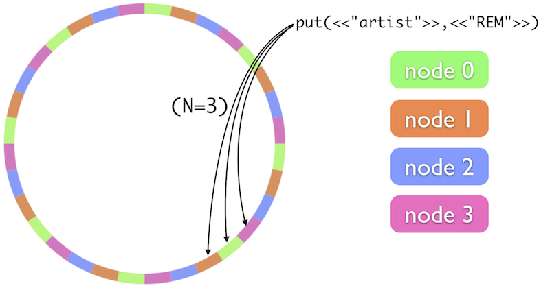

!SLIDE 
### How Riak Works
## Internals

* Cluster, The Ring, Nodes, Vnodes and Partitions
* **N**, **R**, **W** values

!SLIDE smbullets
### How Riak Works
## Clusters

- 1 or more phyiscal host running Riak, connected
- Each host runs one **Node**
- Each **Node** runs several **Vnodes**

!SLIDE smbullets
### How Riak Works
## The Ring

- 160-bit integer space divided into equally-sized **partitions**
- Each **Vnode** claims a **partition**
- 32 **partitions** / 4 **Nodes** = 8 **Vnodes**

!SLIDE
### How Riak Works
## The Ring

!SLIDE
### How Riak Works
## The Ring

!SLIDE smbullets
### How Riak Works
## N, R, W values

- Values are set per **Bucket**
- **N**: The number of partitions to replicate the data to
- **R**: The minimum number of **Nodes** which must return results
- **W**: The minimum number of **Nodes** which must report success 

!SLIDE smbullets
### How Riak Works
## Fault Tolerance

- **N** - **R** = Max number of down nodes for **Read**
- **N** - **W** = Max number of down nodes for **Write**
- **Eventually Consistent**  
  - **partitions/vnodes** are shuffled around to accomidate
